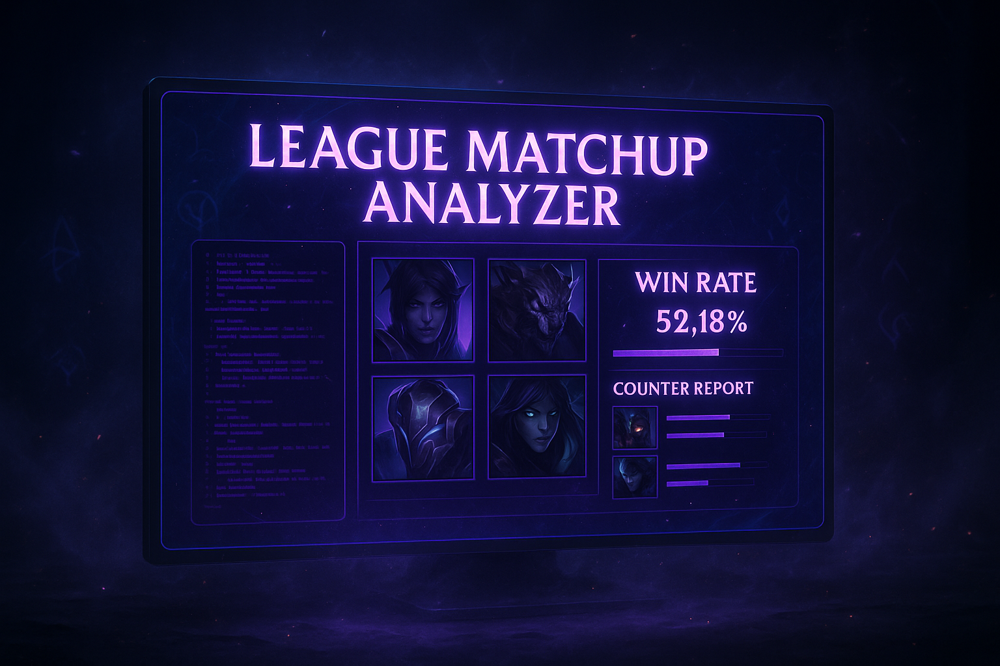
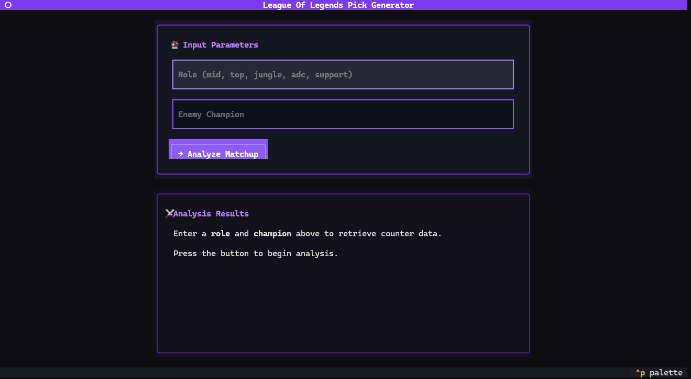
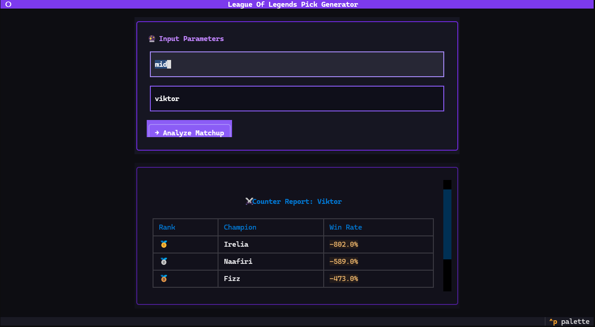

# League Of Legends Pick Generator

A sleek terminal UI application that provides real-time champion counter picks for League of Legends. Scrapes live matchup data from League of Graphs and displays the top 3 counter champions with their win rates in a beautiful, modern interface.



## Features

- **🎨 Modern Terminal UI:** Beautiful, responsive interface built with Textual
- **⚡ Real-Time Data:** Scrapes live matchup statistics from League of Graphs
- **🏆 Top Counter Picks:** Shows the top 3 counter champions with win rates
- **🔍 All Roles Supported:** Works for Top, Jungle, Mid, ADC, and Support
- **💨 Fast & Efficient:** Headless browser with optimized scraping
- **📱 Compact Design:** Fits in small terminal windows (1/4 screen size)

## Screenshots

### Before Analysis


### After Analysis


## How It Works

1. **Input:** Enter your role and the enemy champion
2. **Scrape:** Selenium navigates to League of Graphs and extracts counter data
3. **Display:** Beautiful table showing the top 3 counters with medal rankings
4. **Live Data:** Always up-to-date with current patch statistics

## Setup & Installation

### 1. Prerequisites
- Python 3.10 or newer
- Chrome browser installed
- Git

### 2. Clone the Repository
```bash
git clone https://github.com/YOUR_USERNAME/lolmatchup.git
cd lolmatchup
```

### 3. Create Virtual Environment (Recommended)
```bash
python -m venv .venv

# Windows
.venv\Scripts\activate

# macOS/Linux
source .venv/bin/activate
```

### 4. Install Dependencies
```bash
pip install -r requirements.txt
```

### 5. Run the Application
```bash
python lolmatchup.py
```

## Usage

1. Launch the application with `python lolmatchup.py`
2. Enter your role (mid, top, jungle, adc, support)
3. Enter the enemy champion name
4. Click "→ Analyze Matchup" or press Enter
5. Wait a few seconds while data is scraped
6. View your top 3 counter picks with win rates!

### Keyboard Shortcuts
- `Tab` - Navigate between input fields
- `Enter` - Submit analysis
- `q` - Quit application

## Champion Name Format

Champion names should be entered without spaces or special characters:
- ✅ `viktor`, `leesin`, `masteryi`, `kaisa`
- ❌ `Lee Sin`, `Master Yi`, `Kai'Sa`

## Requirements

```txt
textual>=0.47.0
selenium>=4.15.0
webdriver-manager>=4.0.1
```

## Technical Details

### Architecture
- **UI Framework:** Textual (Python TUI framework)
- **Web Scraping:** Selenium WebDriver with ChromeDriver
- **Data Source:** League of Graphs (leagueofgraphs.com)
- **Design:** Modern CLI aesthetic inspired by Claude CLI and GitHub Copilot

### Scraping Strategy
The application uses XPath selectors to extract:
- Champion names from `<span class="name">` elements
- Win rates from `<div class="progressBarTxt">` elements
- Handles dynamic content loading with appropriate waits
- Automatically manages cookie consent overlays

## Troubleshooting

### Text not visible in input fields
- Make sure you're using the latest version from this repository
- Try maximizing your terminal window
- Ensure your terminal supports Unicode characters

### Scraping fails
- Verify you have Chrome browser installed
- Check your internet connection
- The website structure may have changed - create an issue on GitHub

### ChromeDriver issues
- The app auto-downloads ChromeDriver via `webdriver-manager`
- If issues persist, manually update: `pip install --upgrade webdriver-manager`

## Roadmap

- [ ] Add more detailed matchup tips
- [ ] Save favorite matchups
- [ ] Export results to file
- [ ] Add champion images/icons
- [ ] Support for multiple regions
- [ ] Rune and build recommendations

## Contributing

Contributions are welcome! Please feel free to submit a Pull Request.

1. Fork the repository
2. Create your feature branch (`git checkout -b feature/AmazingFeature`)
3. Commit your changes (`git commit -m 'Add some AmazingFeature'`)
4. Push to the branch (`git push origin feature/AmazingFeature`)
5. Open a Pull Request

## License

This project is licensed under the MIT License - see the LICENSE file for details.

## Disclaimer

This tool is for educational and informational purposes only. It scrapes data from League of Graphs, a third-party website. All data and trademarks belong to their respective owners (Riot Games, League of Graphs). This is an unofficial tool and is not endorsed by or affiliated with Riot Games.

**Use responsibly and respect the website's terms of service.**

## Acknowledgments

- Data provided by [League of Graphs](https://www.leagueofgraphs.com)
- Built with [Textual](https://github.com/Textualize/textual)
- Inspired by modern CLI tools like Claude CLI and GitHub Copilot CLI